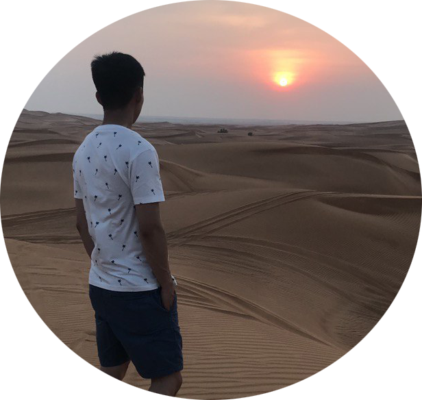

# Anton I

## Contact information:

**Phone:** +7 996 345 21 00

**Email:** i_anton94@bk.ru

**Telegramm:** @CipherSakh

**Discord:** AN#8162

[**GitHub**](https://github.com/SamGepSal)

## About Me

At the moment I work in the supply of oil and gas projects. I am 28 years old and I realized that I work in a field of activity that is not at all interesting for me. At school, the only favorite lesson for me was computer science, I especially remember the days when we wrote the simplest code in Pascal and typeset our first pages in a notebook. Previously, programming was something incomprehensible to me, but when I first wrote "Hello World", I realized that this is what I have been missing all my life. Now I am working hard on my hard skills and I want to become a good programmer with knowledge both in the front-end and back-end.

> My minimum plan: Senior full stack developer

> My maximum plan: Seo of google, apple, microsoft

## Skills

- HTLM5
- CSS3 (SASS/SCCS, BEM)
- GitHub
- JavaScript (in process to learn)
- ReactJS (in process to learn)
- NodeJS (in process to learn)
- Virtual Studio Code, Fork (for git)
- Figma, PhotoShop

## Code Example

    function sum(a, b) {
        return a + b;
    }

## Experience

1. [Practice HTML / CSS Project](https://github.com/SamGepSal/Project-HTML-CSS-proff.git)

## Education

1. **Far Eastern State University of Railways and Communications** (2021, Russia), Bachelor of industrial civil engineering
2. **Donghua University** (2017, Shanghai, China), Bachelor of Chinese language

### Additional Education:

- Geek Brains - FullStack Java Script Developer
- Intensive Business English (60h)

## Languages

- Russian (native)
- English (A2)
- Chinese (HSK 5)
